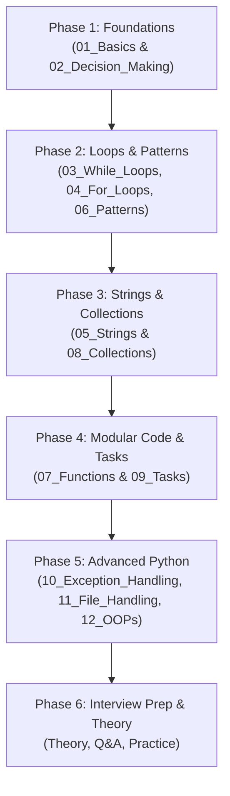

# 🗺️ Python_Works Learning Roadmap & Folder Flow Guide

Welcome to **Python_Works**! This repository is structured as a progressive Python learning and practice curriculum, moving from core fundamentals to Object-Oriented Programming (OOP), real-world problem solving, and technical interview prep.

---

## 🎯 Recommended Learning Path (Step-by-Step Flow)

---

## 📁 Directory Flow & Breakdown

### 1. `01_Basics/` — Python Fundamentals
- **Purpose**: Input/Output, variables, data type conversions, arithmetic calculations, and operators.
- **Subdirectories**:
  - `IO_and_Variables/`: Basic arithmetic, split bill, moving zeros.
  - `Calculations/`: BMI, BMR, electricity bills, simple interest, area & perimeter calculations.
  - `Conversions/`: Celsius to Fahrenheit, years to days, seconds conversion.
  - `Operators/`: Assignment, comparison, square/cube/sqrt, swapping variables.

### 2. `02_Decision_Making/` — Conditional Logic
- **Purpose**: Controlling program execution using conditions.
- **Subdirectories & Files**:
  - `If_Else/`: Basic branching.
  - `Logical_Operators/`: Combining conditions with `and`, `or`, `not`.
  - `Nested_If/`: Branching inside conditional blocks.
  - `Ternary_Operator/`: One-line conditional expressions.
  - `decision_making.py`: Unified practice script.

### 3. `03_While_Loops/` — Condition-Based Iteration
- **Purpose**: Indefinite loops and state-driven repetition.
- **Subdirectories & Files**:
  - `Basics/`: Basic counting, sums, tables.
  - `Number_Problems/`: Reversing numbers, digit sum, counting digits.
  - `Special_Numbers/`: Armstrong, Palindrome, Strong, Neon, Perfect numbers.
  - `while_loops.py`: Core while loop concepts.

### 4. `04_For_Loops/` — Sequence & Range Iteration
- **Purpose**: Definite loops over ranges and sequences.
- **Subdirectories & Files**:
  - `Basics/`: Simple loop counters, step values.
  - `Range_Programs/`: Multiples, factors, primes in ranges.
  - `Number_Problems/`: Factorial, Fibonacci, prime checks.
  - `Special_Numbers/`: Advanced range-based number logic.
  - `for_loops.py`: Summary script for `for` loops.

### 5. `05_Strings/` — Text Processing & Manipulation
- **Purpose**: Working with string methods, indexing, and ASCII operations.
- **Subdirectories**:
  - `Basics/`: Indexing, slicing, string immutability.
  - `Case_and_Characters/`: `upper()`, `lower()`, `swapcase()`, ASCII character checks.
  - `Frequency_and_Search/`: Counting characters, substring searches, anagrams.

### 6. `06_Patterns/` — Nested Loops & Logic Visualization
- **Purpose**: Visualizing loop execution and state tracking using grid patterns.
- **Files**:
  - `star_patterns.py`: Triangles, pyramids, diamonds.
  - `patterns.py`: Number and character pattern grids.
  - `exam_pattern.py`: Complex exam-style pattern questions.

### 7. `07_Functions/` — Modular Programming
- **Purpose**: Code reusability, scoping, recursion, and Python module system.
- **Subdirectories**:
  - `Basics/`: Function definition, parameters, return values.
  - `Math_Functions/` & `String_Functions/`: Built-in and helper function modules.
  - `Args_and_Kwargs/`: Variable positional (`*args`) and keyword (`**kwargs`) parameters.
  - `Lambda_Functions/`: Anonymous single-line functions.
  - `Higher_Order_Functions/`: `map()`, `filter()`, `reduce()`.
  - `Recursion/`: Recursive algorithms (factorial, Fibonacci, call stack understanding).
  - `Modules/` & `Packages/`: Code organization into imported modules/packages.

### 8. `08_Collections/` — Data Structures & Algorithms
- **Purpose**: Lists, Dictionaries, Sets, Tuples, and data manipulation techniques.
- **Subdirectories**:
  - `List_Operations/`: Insertion, deletion, slicing, list methods.
  - `Dictionaries/`: Key-value pairs, nested dicts, dictionary methods.
  - `List_Comprehension/`: Pythonic list creation syntax.
  - `Searching_and_Sorting/`: Linear search, binary search, bubble sort, selection sort.

### 9. `09_Tasks/` — Daily Dated Problem Sets
- **Purpose**: Structured hands-on practice organized by date (e.g., `22-06-26` to `28-07-26`).
- **Flow**: Solve topic-specific challenge problems to consolidate daily learnings.

### 10. `10_Exception_Handling/` — Error & Exception Management
- **Purpose**: Writing robust, crash-resistant Python code.
- **Files**:
  - `exception_handling_intro.py`: `try`, `except`, `else`, `finally`, raising exceptions.

### 11. `11_File_Handling/` — Persistent Storage
- **Purpose**: Reading from and writing to disk files.
- **Files**:
  - `file_handling_intro.py`: Reading (`r`), writing (`w`), appending (`a`).
  - `file_read_exception.py`: Handling missing files and permission errors.
  - `sample_data.txt`, `sample_file_1.txt`: Test data files.

### 12. `12_OOPs/` — Object-Oriented Programming
- **Purpose**: Structuring complex software using classes and objects.
- **Subdirectories**:
  - `Basics/`: Classes, `__init__`, instance methods, self keyword (`oops_intro.py`).

---

## 📜 Key Reference Files & Practice Workspace

| File / Directory | Description |
| :--- | :--- |
| **`TOPICS.py`** | Central index of topics and scripts across all folders. |
| **`PYTHON_TECHNICAL_THEORY.md`** | Comprehensive theoretical reference notes and interview preparation material. |
| **`PYTHON_TECHNICAL_QUESTIONS_AND_ANSWERS.py`** | Executable technical Q&A examples covering Python core concepts. |
| **`Python-pratice/`** | Playground area (`pratice.py`, `questions.txt`) for active experimentation. |
| **`git.txt`** | Quick reference for Git version control commands. |

---

## 🚀 How to Navigate this Workspace

1. **Follow the Numbered Hierarchy**: Work through folders sequentially (`01_Basics` → `12_OOPs`).
2. **Consult TOPICS.py**: Use [TOPICS.py](file:///d:/Python_Works/TOPICS.py) to quickly locate specific scripts or code examples.
3. **Solve Daily Exercises**: Complete the challenge scripts inside `09_Tasks/` as you master each concept.
4. **Prepare for Technical Interviews**: Review theory in [PYTHON_TECHNICAL_THEORY.md](file:///d:/Python_Works/PYTHON_TECHNICAL_THEORY.md) and test your understanding with [PYTHON_TECHNICAL_QUESTIONS_AND_ANSWERS.py](file:///d:/Python_Works/PYTHON_TECHNICAL_QUESTIONS_AND_ANSWERS.py).
